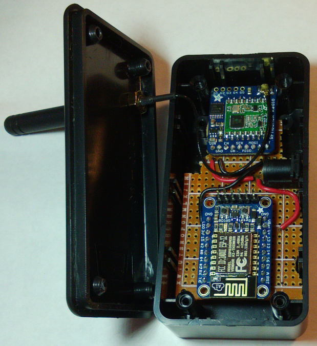
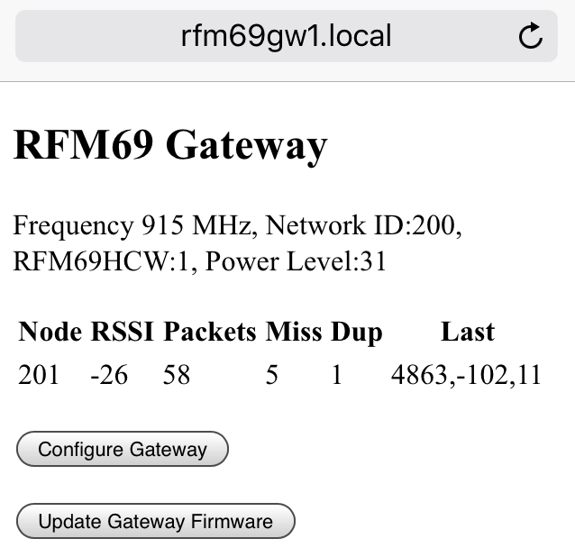
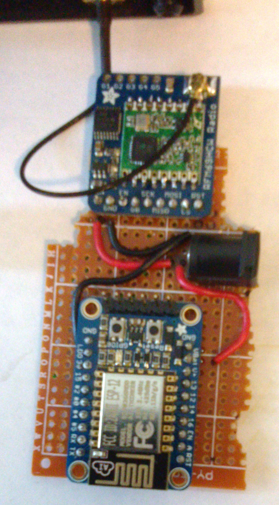
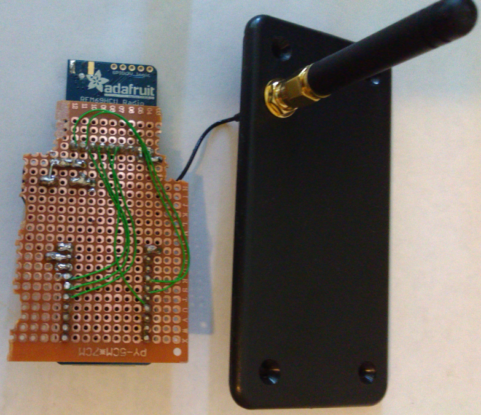
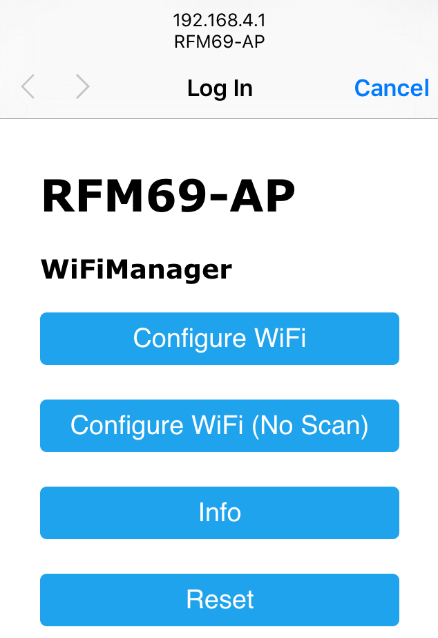
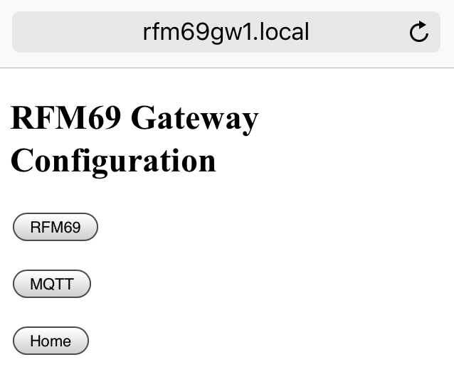
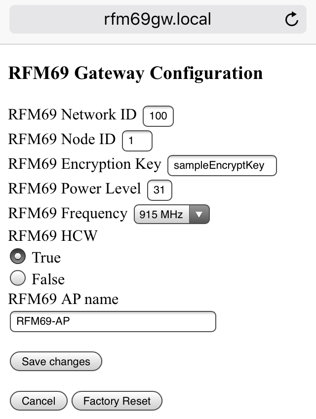
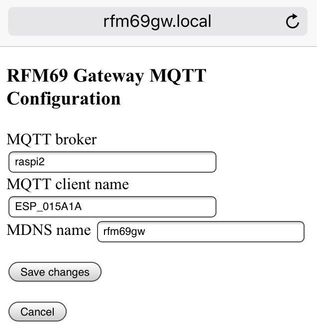

# nanohab
RFM69 gateway and controller for ESP8266 WiFi




An ESP8266 running nanohab is an automation controller for an RFM69 network.
For example, when a [Moteino](http://lowpowerlab.com/moteino/) node reports
motion detected nanohab can send a Maker channel trigger to
[IFTTT](http://ifttt.com). IFTTT can then send an email, SMS message, Tweet,
or do any IFTTT action.

nanohab (TBD) hosts a web server with web sockets for real-time updates.
There is no need for nodejs, socket.io, jquery, apache, etc. The ESP web
server is small but very capable.

```
PIR  -- Moteino <-+
                  |
                  |             nanohab (TBD)
Reed -- Moteino <-+-> RFM69 <-> ESP8266 <-> WiFi <-> Internet
Switch            |             ESP-12
                  |
Temp -- Moteino <-+
Humi
```

The ESP8266 can be used as an MQTT <--> RFM69 gateway for an automation
controller such as OpenHAB or Node-Red running on a Raspberry Pi or clone.
This mode is current implemented and tested. The web interface supports
real-time updates on node packet performance. The RFM69 and MQTT parameters
may be changed.

```
PIR  -- Moteino <-+
                  |
                  v             rfm69gw
Reed -- Moteino <-+-> RFM69 <-> ESP8266 <-> WiFi <-> MQTT broker
Switch            ^             ESP-12
                  |
Temp -- Moteino <-+
Humi
```

## Hardware

### Gateway Hardware

* [Adafruit RFM69HCW 915 MHz breakout board](https://www.adafruit.com/products/3070)
* [Adafruit Huzzah](https://www.adafruit.com/products/2471)
Any ESP-12 based board should work. For example, NodeMCU devkit 1.0, wemos mini D1, Sparkfun Thing, etc.
* [915 MHz antenna SMA](http://www.mouser.com/Search/ProductDetail.aspx?R=ANT-SS900virtualkey54710000virtualkey471-ANT-SS900)
* [u.FL connector](http://www.mouser.com/Search/ProductDetail.aspx?R=73412-0110virtualkey53810000virtualkey538-73412-0110)
* [Antenna cable SMA](http://www.mouser.com/Search/ProductDetail.aspx?R=CAB.011virtualkey57580000virtualkey960-CAB011)
* Project box, prototyping board, etc.





### Node Hardware

* [Moteinos with trace antenna](https://lowpowerlab.com/shop/MoteinoANT)

## References

| Reference              | Description
| ---------------------- | ---------------
| [Adafruit RFM69HCW and RFM9X Tutorial](https://learn.adafruit.com/adafruit-rfm69hcw-and-rfm96-rfm95-rfm98-lora-packet-padio-breakouts/overview) | How to hook up the RFM69HCW breakout boards.
| [LowPowerLab](http://lowpowerlab.com/) | How to hook up the Moteinos

## rfm69gw -- RFM69 to MQTT gateway

* Configure WiFi SSID and password via web page
* Configure RFM69 radio and MQTT parameters via web page
* Configure IP parameters such as static IP, gateway, etc. (TBD)
* Update ESP8266 firmware over WiFi
* Monitor node packet performance with real-time updates
* Build using Arduino IDE for ESP8266
* ESP8266 board is cheaper than Ethernet or WiFi shield

Install ESP8266 from https://github.com/esp8266/arduino#arduino-core-for-esp8266-wifi-chip

### Dependencies

Install these libraries using the Arduino IDE library manager.

* PubSubClient by Nick O'Leary
A client library for MQTT messaging

Be sure to increase the MQTT maximum packet size by modifying PubSubClient.h.
Add the following line to the top of PubSubClient.h. Failure to make this
modification means no MQTT messages will be published.

```
#define MQTT_MAX_PACKET_SIZE 256
```

* WebSockets by Markus Sattler
WebSockets for Arduino (Server + Client)

* WiFiManager by tzapu
ESP8266 WiFi Connection manager with fallback web configuration portal

Install this library from github.

* RFM69 library forked from lowpowerlab.com

https://github.com/bbx10/RFM69/

The most important change is to disable code that enables/disables interrupts.
Disabling interrupts for too long on the ESP8266 results in watchdog timer
resets. This version also works for the Moteino which is not affected by these
changes.

### Hook up

Adafruit RFM69HCW breakout board
LoLin V3 NodeMCU or Adafruit Huzzah

| RFM69HCW breakout | ESP8266 NodeMCU | ESP8266 Huzzah |
| --------- | ----------------- | ------ |
| VIN       | VU (5V)           | VBAT (5V) |
| GND       | GND               | GND |
| EN        | n/c               | n/c |
| G0        | D2 (GPIO04)       | GPIO04 |
| SCK       | D5 (GPIO14/HSCLK) | GPIO14 |
| MISO      | D6 (GPIO12/HMISO) | GPIO12 |
| MOSI      | D7 (GPIO13/HMOSI) | GPIO13 |
| CS        | D8 (GPIO15/HCS)   | GPIO15 |
| RST       | D4 (GPIO02)       | GPIO2 |

NOTE: On NodeMCU boards the pin labels on the board such as D2 and D5 do 
not correspond to ESP8266 GPIO pin numbers. For example, D2 is GPIO4. Use
the Dn labels to connect wires but use GPIO pin numbers in Arduino code.

## Getting started

Look over the source code rfm69gw.ino for default configuration options. All 
parameters can be changed via the web interface so it is not necessary to change
the defaults unless they might interfere with existing networks.

|Default value   | Description  |
|----------------|------------  |
|`#define NETWORKID     200`    | must be the same on all nodes that talk to each other
|`#define NODEID        1`      |
|`#define FREQUENCY      RF69_915MHZ` | must match your RF module
|`#define IS_RFM69HCW    true`  | set to 'true' if you are using an RFM69HCW module
|`#define POWER_LEVEL    31`    | default is maximum
|`const char PROGMEM ENCRYPTKEY[] = "sampleEncryptKey";`  | must be the same on all nodes
|`const char PROGMEM MDNS_NAME[] = "rfm69gw1";`           |
|`const char PROGMEM MQTT_BROKER[] = "raspi2";`           | name or IP address of MQTT broker
|`const char PROGMEM RFM69AP_NAME[] = "RFM69-AP";`        |

### Getting connected to your network

The following assumes the default values shown above.

After uploading the gateway code to the ESP8266, go into Wireless Settings on a
phone or tablet to scan for WiFi access points. Connect to the access point
named RFM69-AP. Configure the SSID and password for your WiFi router. Once the
gateway is connected to the WiFi router, AP mode is turned off. The
phone/tablet should reconnect to your WiFi router.

If the gateway is moved to another location, it will activate AP mode so new
SSID and password values may be entered.



### Web Interface

The status of the gateway can be monitored using a web browser. Connect to
http://rfm69gw1.local. This works best with IOS devices (iPhone, iPod, iPad).
This usually works but if not, use the IP address.


The first section contains various configuration parameters for the gateway
RFM69 radio.

Frequency 915 MHz Network ID:100 RFM69HWC:1 Power Level:31

The second section updates in real-time with received packets from Moteino
nodes. The table columns are described below.

|Column  | Description
|--------|-------------
|Node    | Received packet from this node ID.
|RSSI    | RSSI.
|Packets | Number of packets from node.
|Miss    | Number of missing packets. This is determined by gaps in the sequence number from the node.
|Dup     | Number of duplicate packetets. A duplicate packet is one which has the same sequence number as the last packet.
|Last    | The last message from the node. The message contains sequence number, RSSI, ACK time in milliseconds.

Ideally, missing and duplicate packets should be 0. Low ACK times also indicate a good connection.
Good ACK times are in the range 8-12 ms.








To create the downloadable firmware binary file, in the Arduino, click on
Sketch | Export compiled Binary. The firmware BINary file will be in the same
directory as rfm69gw.ino.

Username: admin Password: rfm69gw

## rfm69send

rfm69send is based on code from Adafruit's RFM69HCW tutorial which is based on
code from Low Power Lab. The code is mainly used to verify reliable
communication with the gateway.

Changes

* Resends up to 10 times if the gateway does not ACK.
* Time in milliseconds shown between sending message and receiving ACK.
* Send incrementing sequence number, RSSI, and time in ms to receive ACK to
the gateway. The gateway uses the sequence number to detect missing and
duplicate packets.

### Hook up

The Moteino has a trace antenna so there is not much to do except to connect an
FTDI cable and upload rfm69send.

## Site Survey

Place the gateway at the center of the site. Connect to the gateway main web
page using a phone or tablet. Walk around the site with a battery powered
Moteino running the rfm69send program. Check missing, duplicate, and ACK times.
RSSI is important but sometimes RSSI is OK but missing packets or high ACK
times occur.

## ToDo?

* Add NTP for date/time stamping.
* [nanohab] interface to IFTTT, ThingSpeak, etc.
* [nanohab] data logging with charts, graphs, etc.

## License

rfm69send.ino and rfm69gw.ino are based on examples on Adafruit's site. The
Adafruit examples are based on Low Power Lab's RFM69 code and includes Low
Power Lab's copyright. I carried over the Low Power Lab copyright/license.
